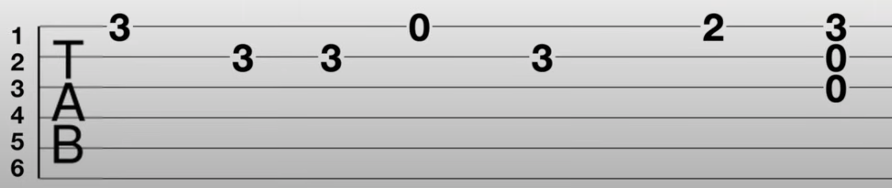

# Clase 01

## Partes de una guitarra

* clavijero: tiene 6 clavijas
* cejuela
* trastes
* brazo/mástil
* diapason: es la parte delantera del mástil
* cuerpo/caja/tapa
* boca: sale el sonido al exterior del instrumento
* puente: se ata la cuerda

## Cuerdas

* 6 cuerdas
* se enumeran de abajo hacia arriba

  

* cuerda 1 es la más fina: sonido agudo
* cuerda 6 es la más gruesa: sonido grave

* cuerdas duran 3 a 6 meses
* tipos de cuerdas: nylon o acero dependiendo del tipo de guitarra

## Trastes

* +12
* se enumeran de izquierda a derecha

## Afinación

* Aplicación: guitartuna
* Guitarra 6 cuerdas: 3+3
* Calibrar: 440 Hz
* Cifrado: español
* Autom: desactivado
* Operaciones: tensar (apretar) / destensar (aflojar)
* Objetivo: llegar al centro por cada cuerda

## Notas

  | Nota | Cifrado Americano |
  | --   | -- |
  | DO   | C  |
  | RE   | D  |
  | MI   | E  |
  | FA   | F  |
  | SOL  | G  |
  | LA   | A  |
  | SI   | B  |

## Cuerdas al aire

* Notas que se consiguen sin tener que pisar con la mano izquierda
* Notas sirven para construir melodias

  | Cuerda | Nota |
  | --     | --   |
  | 1      | MI   |
  | 2      | SI   |
  | 3      | SOL  |
  | 4      | RE   |
  | 5      | LA   |
  | 6      | MI   |

* LA: 3ra. cuerda + 2do. traste

### Ejemplo: SALTA ASÍ

1. SOL SOL SI
1. SOL SOL SI
1. SI SI LA
1. SI LA SOL

### Ejemplo: PARA ATRÁS

1. SI LA SOL
1. SI LA SOL
1. SI SI LA LA SOL

## Acordes

* Posibilidad de tocar varias cuerdas en forma conjunta al mismo tiempo
* Permite crear acompañamiento de canciones (ritmos)

## Dedos de la mano izquierda

* pulgar: descansando en la parte trasera del mastil
* dedos pisan en los trastes

  

## Dedos de la mano derecha

* meñique: no se usa
* pulgar: descansa en la 6ta cuerda
* se toca en el centro de la boca

  

## Posición

* relajada
* apoyar guitarra en pierna derecha o izquierda
* mastil lleva trayectoria ascendente
* mano derecha descansa de forma arqueada frente a la boca
* pulgar de mano derecha arriba del brazo del último traste
* elevar pierna izquierda con soporte

## Ejercicio 1

* 1 2 3 y (se entra)
* dedo i (o pua hacia abajo) en cuerda 1

* Luego dedo i y m en cuerda 1

## Ejercicio 2

* cuerda 1 al aire
* dedo 3 en traste 3 cuerda 1
* cuerda 1 al aire
* dedo 1 en traste 1 cuerda 1

## Diagramas de acordes

* Gráficos que muestran un fragmento de la guitarra en una posición

  ```plain
  --- ACORDE Mim (Em) ---

  cuerdas  ->  6 5 4 3 2 1

               o     o o o         
  traste 1 ->  | | | | | |
  traste 2 ->  | 1 2 | | |
  traste 3 ->  | | |*| | |
  traste 4 ->  | | | | | |

  *: indica traste 3 (sirve para orientar)
  1: dedo 1 pisa la cuerda 5 traste 2
  2: dedo 2 pisa la cuerda 4 traste 
  o: cuerdas al aire
  ```

  ```plain
  --- ACORDE LAm (Am) ---

  cuerdas  ->  6 5 4 3 2 1

               x o       o         
  traste 1 ->  | | | | 1 |
  traste 2 ->  | | 2 3 | |
  traste 3 ->  | | |*| | |
  traste 4 ->  | | | | | |

  x: indica que la cuerda NO debe sonar
  ```

## Ejercicio 3

  ```plain
    MIm (Em)

  o     o o o         
  | | | | | |
  | 1 2 | | |
  | | |*| | |
  | | | | | |
  ```

  ```plain
    SOL (G)

  x x o o o         
  | | | | | |
  | | | | | |
  | | |*| | 3
  | | | | | |
  ```

  ```plain
  LA sus2 (Asus2)

  x o     o o         
  | | | | | |
  | | 1 2 | |
  | | |*| | |
  | | | | | |
  ```

1. Mim (Em)
1. SOL (G)
1. LA sus2 (A sus2)
1. Mim (Em)


## Tabla de acordes


## Tablaturas (TABS)

* Forma de escritura musical mas sencilla para guitarra
* Son 6 líneas (cuerdas) y números (trastes)
* Son líneas de tiempo, se leen de izq a der

  ```plain
  cuerdas

  |
  v

  1 ---3------------------
  2 ----------------------
  3 --------------0-------
  4 ----------------------
  5 --------2-------------
  6 ----------------------

  0: cuerda al aire
  ```

  

## Partitura (pentagrama)

* Se llama pentagrama porque tiene 5 líneas
* Sirve para representar notas musicales con sus duraciones que se pueden tocar con cualquier instrumento

  | Figuras    | Duración  | Rasgueo |
  | --         | --        | -- |
  | Redonda    | 4 tiempos | abajo |
  | Blanca     | 2 tiempos | abajo |
  | Negra      | 1 tiempo  | abajo |
  | 2 corcheas | 1 tiempo  | abajo y arriba |

  

* Compás de 4 tiempos (4/4): es un espacio de tiempo donde tocamos notas musicales.

* Tablatura coincide con la partitura

## Samba de mi esperanza

```plain
  LA (A)

x o       o        
| | | | | |
| | 1 2 3 |
| | |*| | |
| | | | | |
```

```plain
  MI (E)

o       o o        
| | | 1 | |
| 2 3 | | |
| | |*| | |
| | | | | |
```

```plain
  RE (D)

x x o        
| | | | | |
| | | 1 | 2
| | |*| 3 |
| | | | | |
```

A

1. | LA | LA | LA  | MI |
1. ||: RE | LA | MI | LA :||

B

1. | LA | MI | MI | LA |
1. ||: RE | LA | MI | LA :||

  

## Rasguido de zamba

  
